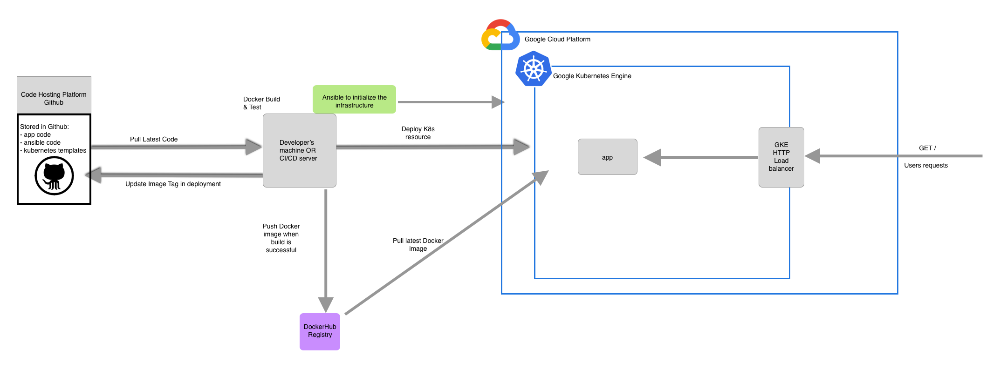

# x-test

The DevOps challenge is straight forward: develop a simple Hello World in the language of our choice respecting some stated requirements, then detail a target architecture finally implement it!

Nowadays the challenge of a devOps engineer, on top of being an expert across different domains of IT: system, networking, development, is mostly about understanding tools and choosing what is the most efficient for a given task. Hence this challenge is particularly relevant when it comes to the work of an SRE person.  

# Tooling choice

I will quickly detail here why I choose such tools or technologies, some choices might be simply motivated because they are the tools I know the best.

### Development
 
For the language I have chosen `NodeJS` as it is straight forward to develop a small HelloWorld with `express.js`

### Virtualization

I have decided to dockerize the application, docker has many advantage such as portability and scalability. What is more I will use `kubernetes` for the cloud as it is the best orchestration tool for docker containers at the moment. 

### CI/CD

CI/CD is not part of the scope of this exercise.

### Cloud Platform
 
Lately `GCP` is my go too platform for kubernetes. As I have been working with docker/kubernetes for the past 4 years, the provisioning of a GKE cluster is much faster on Google (5 min) than in AWS with EKS (at least 20 minutes). However AWS has a lot of tools and resources that Google does not have yet.

### Provisioning

For the provisioning of the infrastructure, nowadays we have two evident choices: `terraform` or `ansible`. I have chosen the latter as I already worked with `ansible` to provision GKE and know it is a working combo.

### Sum up

I will use the following tools:

```
NodeJS (8.4)
Docker
Kubernetes
GCP
Ansible
```

## HelloWorld app

As it is a NodeJS app (tested in 14.5) in the `./app` folder:

`npm install` 

You will need a `.env` file with all the environment variable (PORT) or you can just add it int front:
To run the server:

`PORT=3000 node index.js`

for the .env variable file:
```
PORT=3000
```

You can the call the endpoint at `http://localhost:3000/` to see all the hello world message.

## Tagging Strategy and push scripts

Concerning the tagging strategy I've decided to use a classic combo of <BRANCH_NAME>-<COMMIT_SHA_SHORT> which allow anybody to quickly check which version of an image is running in production or any other environments. What is more I added in front a <TIMESTAMP> so that we can properly order the tags on a particular registry. This helps us to easily find the latest built and pushed image.
All args are optional and will default to local values if you don't set them.

To use the build and push script:
```./push <BRANCH> <COMMIT> <REGISTRY_HOST>```

and to verify the latest tag:
```./retrieve_latest.sh <IMAGE_NAME> <REGISTRY_HOST>```

## Target Architecture




With this architecture I am trying to achieve a simple infrastructure and to enforce `Infrastructure As Code` by committing back to Github if possible; ideally the infra would be on a different repository than the application and we would need a CI/CD tool that would modify the version of the image we want to deploy in the kubernetes yaml file automatically. Since here we do not have any CI/CD component, we have to manually update the version in the yaml file. We could have done it in the `./push` script also.
The Google Kubernetes Engine (GKE) allows us to have the advantages of kubernetes while not having to manage its components and the integrated tools of `stackdriver` allow us to easily have logging and monitoring.

## How to deploy 

Here are the requirements for the tools:

```
ansible 2.9.2 (need python)
kubectl 1.15.2
```

### To provision via Ansible

First create an account on google cloud.
On GCP go in IAM > service accounts and create a key for the Compute Engine default service account (Edit > Create key > json), save the key on your computer. You might need to go to the kubernetes engine section to enable the API which will create the service account by default.

You will then need to export the variables where you will run the ansible script.

```
export GCP_SERVICE_ACCOUNT_FILE=/Users/guillaumedury/Downloads/project-66268096df95.json (path to your key file)
export GKEUSER=user@gmail.com (email used for the google account)
```
Modify the `ansible/vars.yml` according to your own settings, you might need to change the email, the project id or the zone.

Then you need to run (inside `./ansible`):

```
ansible-playbook create-gke-cluster.yml --extra-vars "cluster_name=test"
```
This will provision the GKE cluster, it takes around 10 minutes.
You can verify your cluster is properly running by using:

`kubectl get pods --all-namespaces`

### To Deploy Kubernetes resources

Once the GKE cluster is provisioned, we can add the kubernetes resources. Go to the `./kubernetes` directory and verify the `app-configmap.yaml` which holds the environment variable. I have decided willingly to not use Helm to manage the configuration of my app as it can be heavy for such a simple app. What is more, Helm version 2 was flawed and very hard to work with to manage production resources and flow. Since I think the easier the better, here it is a logical choice to go with raw yaml files. If necessary I would go more for tools such as ArgoCD to enforce gitOps. It could also be interesting to test and maybe use helm 3.

```
PORT: "3000"
```
fill this file and from there run:

`./deploy-app.sh`

This will apply to your cluster all the resources, the app, and expose the app via an HTTP load balancer. You can find the public IP via:

`kubectl get svc xtest-svc`

and note the `EXTERNAL-IP` which is your endpoint, exposed on port 80. We can test it and check that everything is working!


## Possible Improvements

This architecture is for me a complete proof-of-concept to show what I can do as a Devops/SRE engineer and the tools I am familiar with. I will detail here a few  axis of improvements to bullet proof this system and make it more production ready.

### Branching strategy

I did not take into account any branching strategy for the CI/CD nor the deployment part, considering only master branch and a unique environment. In reality (in a software development team) this can be different as we would use other branches and other environments (such as staging, uat) to ensure users can test the software before releasing to production. Fortunately all the configurations is externalised in environment variables and travis could allow us to select different deployment strategy depending on the branch.

### Scalability

This system is currently scalable to a certain point. One solution could be to add Horizontal Pod Autoscaler resources in Kubernetes to ensure that Kubernetes spawn new pods in the `xtest-app` deployment in case of high usage in terms of resources (CPU/Memory) combined with an auto-scaling in terms of nodes in the GKE settings. This would ensure that the system will accept a high number of connections. 

### Endpoint

The endpoint of the app is currently totally exposed to the outside via a public IP given by GCP. As a best practice, I would put the app behind a reverse proxy such as Nginx to control exactly what kind of endpoints are exposed. What is more having Nginx in front would allow us to have SSL termination to enhance the security of the communication of our users with the app (and the SEO at the same time).

### Security 

In terms of security, we could, as I was saying earlier add SSL termination via Let's encrypt for example. 

# Conclusion

I hope you will enjoy this work as much as I enjoyed working on it. I love to create cloud infrastructures and design system that are scalable. At the same time, I strongly believe the role of a DevOps/SRE engineer is to help empower the developers to own their code all the way to production!

Regards,
